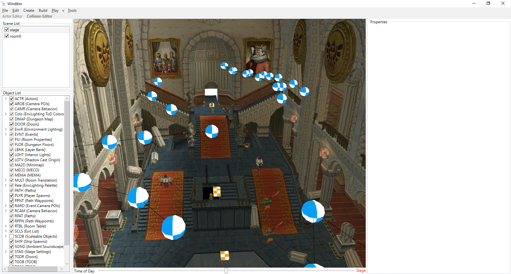
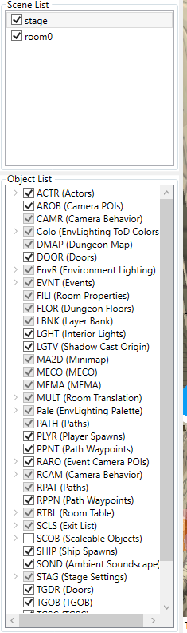
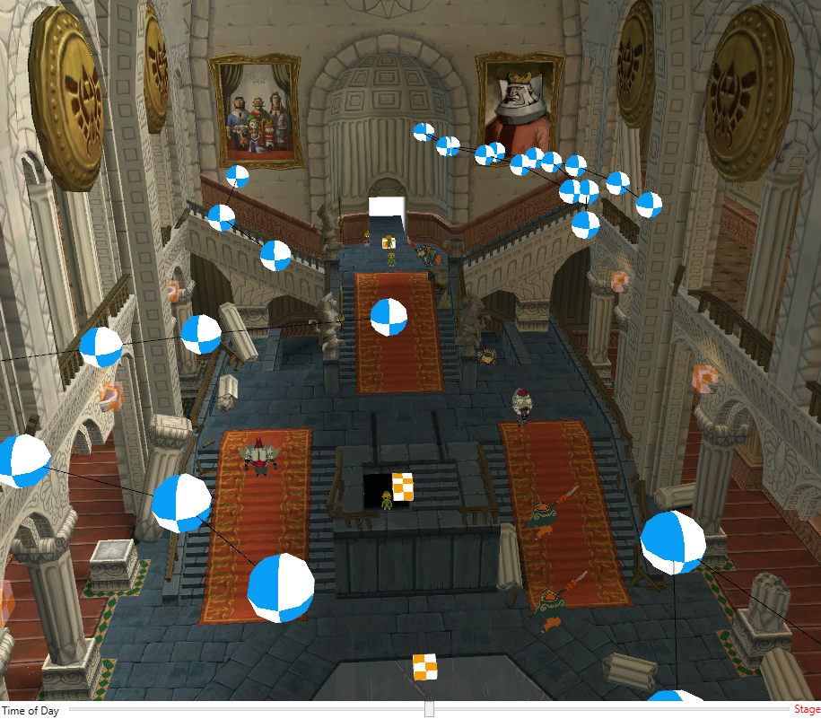
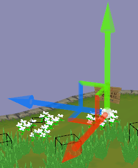
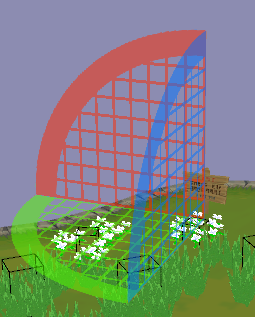
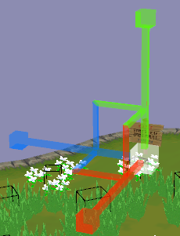
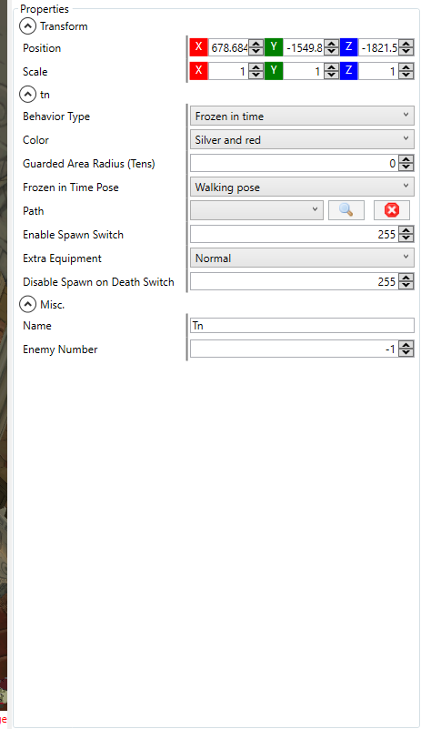
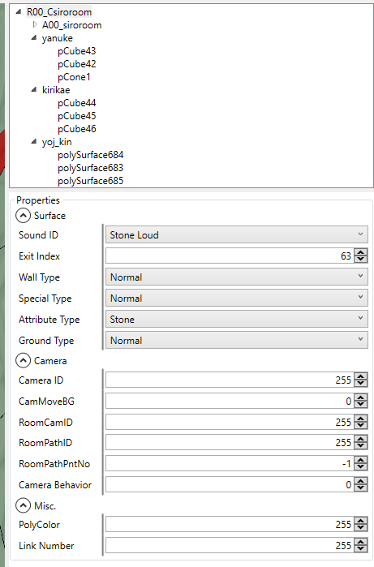

## Basics
This tutorial will go over the general features of Winditor and how to set it up for use.

## Main Window

When you download Winditor and open it up, you will be presented with the main window. This is where you will do most of your actor and collision editing. It is split into 4 main parts: the toolbars, the scene view, the viewport, and the mode panel.

### Toolbars

  

The toolbars contain various options and features that you can use while editing maps.

* File
  * Open
    * Stage: This will open a folder selection dialog, asking you to select a folder containing a map. Typically, you will be opening a folder within game's `Stage` directory, which is located at `files/res/Stage` in the ISO. When you select a folder, Winditor will open all the rooms contained within it. Opening all rooms at once can result in lag and potentially crash Winditor, so it is best to use the option below for large maps, such as the overworld map `sea`. 
    * Rooms: This will open a file selection dialog, asking you to select one or more room archives to open. When you confirm the dialog, Winditor will open the selected rooms in addition to their Stage.arc, if one is present in the folder.
  * Save: This will save the map as individual files to a location on your computer. These are not archive files (.arc), but rather what is *in* the archives - visual meshes (.bmd/.bdl), collision meshes (.dzb), and actor setups (.dzr/.dzs). If the map was opened from archive files, this option will ask you to choose a folder to save the extracted files to. If the map was opened from a folder containing these individual files, Winditor will silently update them to match what is currently in the editor.
  * Save as: Performs the same function as the above, except it will always ask for a location to save the individual files to. This is useful if you want to duplicate a map without manually copying and pasting.
  * Import
    * Visual Mesh: This option allows you to import a visual mesh - a model that the player can see - into the map. It will open a dialog asking you to choose a file to import, which scene to place it in, and which slot it should occupy within the target scene. The dialog will accept any files that SuperBMD can accept, including .dae files, .fbx files, and .bmd/.bdl files.
    * Collision Mesh: This option allows you to import a collision mesh - a model that the player cannot see that determines what is solid in the map. Similarly to importing a visual mesh, selecting this option will open a dialog asking you to select a file to import and the scene that it should be placed into. A room can only have one collision mesh.
  * Export:
    * Visual Mesh and Collision Mesh: These are the opposite of the Import options above. They allow you to export the visual and collision meshes of a specific scene as .dae files.
  * Close: This closes the current map, while keeping Winditor open.
  * Exit: This closes Winditor entirely, exactly like clicking the X in the top right corner.
  
### Scene View

  

The **Scene View** is composed of two components: the Scene List on top, and the Object List on the bottom.

#### Scene List
The Scene List displays the currently loaded scenes, which include the map's Stage and its Rooms.

* The **Stage** is made up of global objects which are loaded regardless of what Room Link is in. In most cases, these include lighting and exit data. However, any object type can be placed here. The skybox models are also contained within the Stage, as well as the textures for clouds and the map's Event List.
* **Rooms** are individual spaces composed of models, collision data, and object setups. A map requires at least one room, and it can have up to 64.

##### Controls
* **Left-clicking** on a scene in the list will make the scene active, and display its objects in the Object List.
* **Toggling the checkbox** to the left of a scene will show or hide that scene's components - models, collision, and objects.

#### Object List
The Object List displays all of the objects within the selected scene. The `Models` and `Collision` categories are special categories that represent the scene's visual models and collision mesh. The rest of the categories are named after their identifiers in the files with a short description of what they are.

##### Controls
* If there is a small arrow to the left of an object type, **left-click it** to show the object instances beneath it.
* If there *isn't* an arrow by the object type, you can **right-click** on it and select "Add Object" from the context menu to add a new instance of that type.
* You can also select "Go Here" from the context menu to move the camera directly to that object.
* **Left-click** an instance of an object to display its properties in the Mode Panel on the right side of the screen.

### Viewport

  

The map and rooms that are currently loaded will be displayed in the **Viewport**. It shows all of the entities within the map that have positions within the world, even if they are not displayed in-game. The controls are as follows:

#### Movement
* **Right-click and drag** on the viewport to look around the scene.
* While holding the right mouse button, **use the W, A, S, and D keys** to move around the map.
* While moving around the map, **hold shift** to move faster.
* You can also adjust movement speed by **scrolling in and out with the scroll wheel.**

#### Object Manipulation
* Select an object by **left-clicking** on it.
* To select multiple objects, hold **shift** while left-clicking.
* To undo an action, **press ctrl + Z**.
* To redo an action, **press ctrl + Y**.

##### Translation

  

* When an object is selected, the Translation Widget will appear. **Left-click and drag** on any of the arrows on the widget to move the object along that axis.
* Left-click and drag **on the squares between arrows** to move the object on both of those axes at once.
* **Press the W key** to switch back to the Translation widget if you have switched it to the Rotation or Scaling widgets.

##### Rotation

  

* With an object selected, **press the E key** to switch to the Rotation Widget.
* **Left-click and drag an arc** on the widget to rotate the object on that axis. Note that many objects do not support rotating in all directions.

##### Scaling

  

* With an object selected, **press the R key** to switch to the Scaling Widget.
* **Left-click and drag a cube** on the widget to scale the object on that axis. Note that many objects do not support scaling.

### Mode Panel

The **Mode Panel** is to the right of the Viewport. It is initially blank, but it will change depending on what editing mode Winditor is in and whether you have an object selected in the Viewport. These are the forms that the Mode Panel can take:

#### Actor Editor

  

When in Actor Mode, the Mode Panel will be blank until you select an object, either through the Viewport or the Object List. The panel will then be filled with all the properties of that object that you can edit.

* **Hovering over the label of a property** will pop up a tooltip describing what that property does.
* The Position and Scale properties can be used to precisely position and scale the object.

#### Collision Editor

  

When in Collision Mode, the Mode Panel will display the collision mesh's hierarchy on top and a blank panel on the bottom. The bottom panel will change depending on what you select.

For more information about the Collision Editor, see the [Collision Editing tutorial](../collision/collision.html).

  <a href="../tutorials.html">Back</a>

