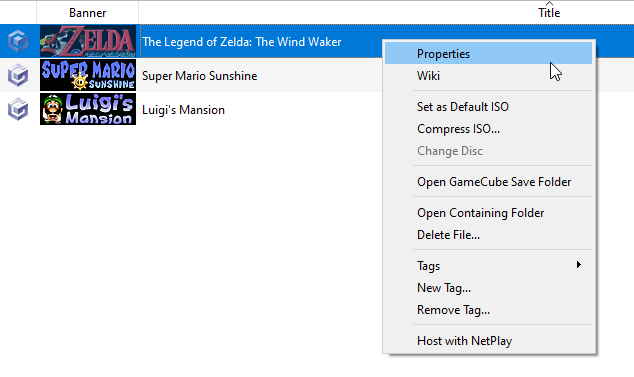
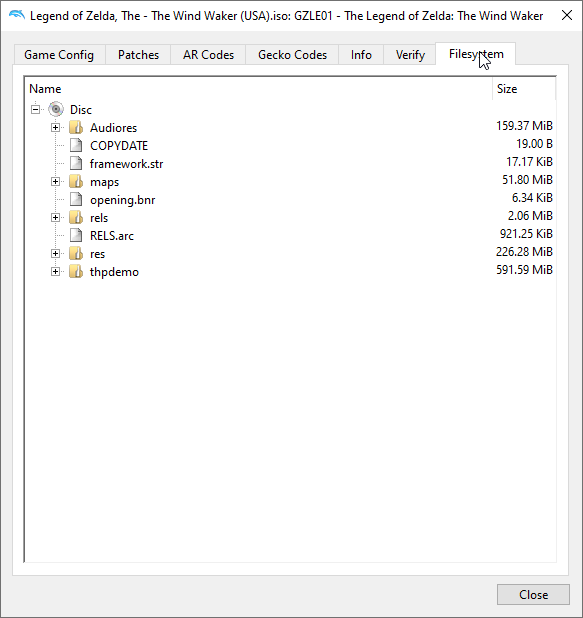
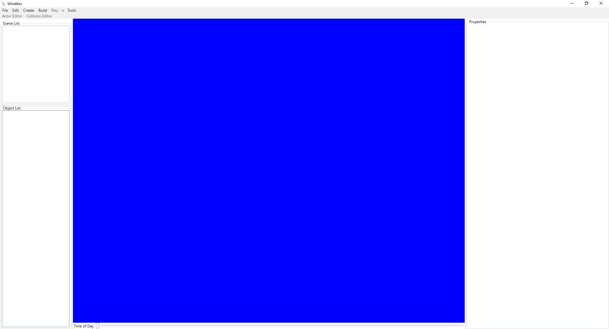
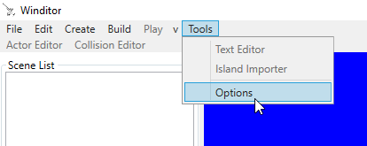
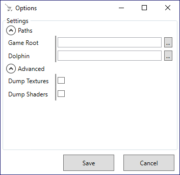

## Getting Started
This tutorial will talk about a couple of things you should know before you begin using Winditor for the first time.

### Extracting the Files
In order to edit *The Wind Waker*, the files must be extracted from a disc image using a recent version of <a href="https://dolphin-emu.org/">Dolphin</a>. **We cannot provide you with a copy of the game.** The safest way to get a copy of the game is to <a href="https://wiki.dolphin-emu.org/index.php?title=Ripping_Games">rip it yourself.</a>

Open Dolphin. Right-click on *The Wind Waker* in the Games Panel and click "Properties":

  

In the Properties dialog that pops up, click on the "Filesystem" tab on the far right:

  

Right click on "Disc" and choose "Extract Entire Disc..."

  

Select a location for the extracted files to be placed; remember this location - you'll need it later. Once Dolphin has finished extracting the files, you're done with this section. If you go to where the files were extracted, you will see that Dolphin has created two folders - `files` and `sys`. The `files` folder contains the game's resources, such as models, text, and maps; `sys` contains the game's executable, `main.dol`, along with other metadata about the game's disc.

**Note**: We recommomend making a copy of the extracted files and making edits to that copy. Having an unmodified version of the game will make restoring broken files much easier.

### Downloading Winditor
The "Latest Release" button at the top of this website will start a download of the most up-to-date version of Winditor. It will be in a typical ZIP file, which can be extracted in any way you wish.

### Setting Up

  

When you open Winditor, it should look like the image above. Before you start using it, there are two options that should be configured. Open the options menu by going to Tools -> Options in the menu bar:

  

#### The Options Menu

  

The options that we are interested in are the first two:

* **Game Root**: This is the path to the folder containing the game's `files` and `sys` directories, as extracted in the "Preparing the Game" section above. **Note that any edits are saved to this copy of the files**.
* **Dolphin**: This is the path to an installation of Dolphin 5.0. There is no known restriction on versions, but we recommend using the latest nightly version.

Setting both of these will allow you access to playtesting and any tools in the Tools menu. It will also allow Winditor to display actors with their proper models instead of displaying them as cubes. Click the "..." buttons by each option to open a folder selection window, then use it to choose the appropriate folders.

  <a href="../tutorials.html">Back</a>

