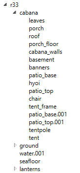
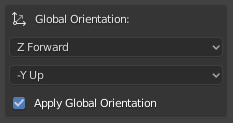
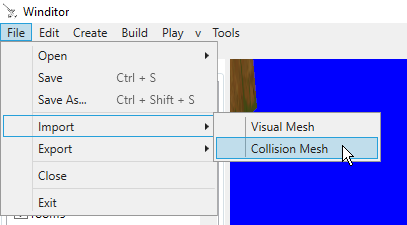
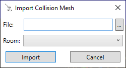

## Importing a Collision Mesh
This tutorial will go over how to import a collision mesh into a map using the Import Collision Mesh dialog.

## Preparation
Here are a few things to keep in mind when importing collision:

* Only models in DAE format are acceptable for collision meshes.
* In order for water and lava collision to work correctly, the model must be organized into three levels - a root node, any number of "category" nodes, and the meshes themselves, as shown below:

  

  * `r33` is the root node
  * `cabana`, `ground`, and `lanterns` are the category nodes
  * `leaves`, `porch`, etc. are the actual meshes containing geometry data
  * In Blender, this can be achieved by having an empty object as the root with empties as children representing the categories. Each category can then have the meshes in the model as children.
  * **If the model is not structured like this, water and lava WILL NOT work correctly!**

### A note on exporting collision meshes from Blender

When exporting a collision mesh from Blender to DAE, make sure you change the option that says "Y Forward" to "Z Forward" and the option that says "Z Up" to "-Y Up", and also tick the checkbox that says "Apply Global Orientation".

  

If you do not change all three of these settings in the DAE export options from their default values, the collision mesh may be rotated 90 degrees once you import it into Winditor.

## Where to Look
The Import Collision Mesh option can be found in the File menu, at File -> Import -> Collision Mesh.

  

## The Dialog
Upon clicking the menu option, you will be presented with the Import Collision Mesh dialog.

  

The options are:
* **File**: This is where you will choose the file to import. Clicking on the "..." button to the right of the textbox will open a file chooser. Winditor supports *only* .dae files for collision meshes.
* **Scene**: Each Room in a map can have one collision mesh. This box allows you to choose which Room to import the chosen mesh into. Selecting a Room that already has a mesh will replace its mesh with the chosen one.

  <a href="../tutorials.html">Back</a>

