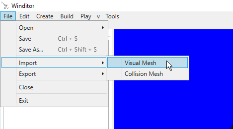
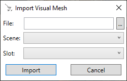

## Importing a Visual Mesh
This tutorial will go over how to import a visual mesh into a map using the Import Visual Mesh dialog.

## Where to Look
The Import Visual Mesh option can be found in the File menu, at File -> Import -> Visual Mesh.

  

## The Dialog
Upon clicking the menu option, you will be presented with the Import Visual Mesh dialog.

  

The options are:
* File: This is where you will choose the file to import. Clicking on the "..." button to the right of the textbox will open a file chooser. Winditor supports any file formats that SuperBMD supports, including .dae files and .fbx files. You can also import existing .bmd/.bdl files, whether they are from the game or they were created with SuperBMD beforehand.
* Scene: This is where the model will be imported into the map. You can select the map's Stage, or one of the map's rooms. Your selection here will change the next box, Slot.
* Slot: Each scene has a fixed number of meshes that can be imported into it, and this box determines where your selected mesh ends up. The slots change depending on whether you have a Stage or a Room selected in the Scene box.
	* For Stages, these are the available model slots:
		* Main Skybox: This is the model that makes up the majority of the sky. In-game, this is a cylinder with a solid color. The model name for this mesh is `vr_sky.bdl`.
		* Horizon Clouds: This is the model that makes up the clouds that ring the horizon. The model name for this mesh is `vr_back_cloud.bdl`.
		* Horizon Sea: This model simulates the ocean at a distance, making the water look like it goes farther than it does. The model name for this mesh is `vr_uso_umi.bdl`.
		* Horizon Gradient: This model is a gradient that fades from the main skybox's color to another color. The model name for this mesh is `vr_kasumi_mae.bdl`.
		* Normal Dungeon Door: This is the model used with a TGDR entry  Its internal name is `door10.bdl`.
		* Boss Dungeon Door: Its internal name is `door20.bdl`.
		* Dungeon Door Lock: This is the model placed over a door when the door is locked and requires a key. Its internal name is `key10.bdl`.
		* Dungeon Door Bars: This is the model placed over a door when it is barred, usually requiring a puzzle to be solved or the enemies in a room to be killed. Its internal name is `stop10.bdl`.
	* For Rooms, these are the available model slots:
		* Main: This is typically the bulk of the room's model, excluding water or other special effects. Its internal name is `model.bdl`.
		* Water: This mesh is usually made up of all the water planes in the room. Water is separated from the main mesh like this to make animating it easier. Its internal name is `model1.bdl`.
		* Misc.: This mesh has no strict purpose - it fulfills whatever role the developer sees fit. Its internal name is `model2.bdl`.
		* Backfill: This mesh typically makes up the lighting found behind doors and windows on the overworld, or behind cave entrances. The color of the gradient changes based on the map's lighting configuration. For example, it can change from black to yellow as night falls to show that there is a light on in a building. Its internal name is `model3.bdl`.

  <a href="../tutorials.html">Back</a>

