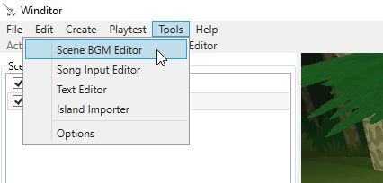

## Changing Scene BGMs
This tutorial will go over how to use Winditor to change what background music plays in each stage or island.

### Patching Your Project
Before you can use Winditor to change which BGM plays where, you first need to apply a code patch to your modified Wind Waker project (Winditor itself cannot currently apply this patch). If you try to use the BGM editor without doing this step, your changes will appear to be saved in Winditor, but the game itself will ignore them and continue to use the original music.

First you must install the [WW_Hacking_API](https://github.com/LagoLunatic/WW_Hacking_API) repository to allow Wind Waker's code to be modified. To do so, follow the instructions in the Requirements and Installation sections of that repository's README.

Once you have that repository set up, open the file WW_Hacking_API/asm_patches/main.asm in a text editor and delete just the semicolon at the start of the line that says `;.include "includes/bgm_file.asm"`. Then save the file.

Then open the WW_Hacking_API directory in your PC's command prompt, and run the follow commands:
* `py asm_api/assemble.py`
* `py asmpatch.py "path/to/Vanilla WW.iso" "path/to/Modded WW"`

"path/to/Vanilla WW.iso" refers to where you keep your copy of vanilla unmodified Wind Waker file on your PC, while "path/to/Modded WW" refers to the folder where your extracted Game Root is for your Wind Waker mod.  
You don't have to type these two paths manually; instead you can drag and drop the file and the folder onto the command prompt and the correct paths will be filled in for you (but remember to manually type a space after dropping the vanilla ISO path).

If the commands ran successfully, then your mod's code should now be patched and allow for BGMs to be changed. Try using Winditor's Scene BGM Editor to change some and check if it worked.

### Opening the Scene BGM Editor
In order to use the BGM editor, you must have a Game Root set in the Options menu. To set that up, see the [Getting Started](../basics/gettingstarted.html) guide.

To open the editor, go to Tools -> Scene BGM Editor:

  

### The Editor

  

The BGM editor has two tabs:

The Maps tab allows you to set which BGM plays in each stage, except for the sea. You can use the Add button at the bottom to add more stages to the list if the one you want isn't already there.

The Islands tab allows you to set which BGM plays in each of the sea's 49 islands.

### Editing a Scene's BGM Properties
* **Type**: Whether this scene should play a sequenced BGM track (.bms files, located in files/Audiores/Seqs/JaiSeqs.arc) or a streamed BGM track (.afc files, located in files/Audiores/Stream). If you choose a sequenced track, be sure to also modify Wave Banks 1 and 2 to load the instrument samples necessary for that track to sound correct. Streamed tracks do not require samples, so you don't have to set the Wave Banks for them.
* **Name**: Which specific BGM track this scene should play.
* **Wave Bank 1** and **Wave Bank 2**: These control the first two wave sample soundbanks (.aw files, located in files/Audiores/Banks) that should be loaded for this scene, usually containing instrument samples for the sequenced BGM track that plays in this scene.
* **Wave Bank 3** and **Wave Bank 4**: These extra soundbanks usually do not contain instrument samples for sequenced BGM tracks like the first two do. Instead, these tend to load in extra sound effects specific to this scene. Be sure to load the correct soundbanks or certain actors specific to this scene may not play any sounds. (Note that these extra soundbanks can also be used for instrument samples in some cases, such as the Big Octo battle theme on the sea.)

  <a href="../tutorials.html">Back</a>

