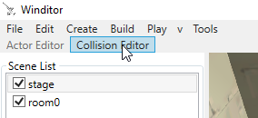
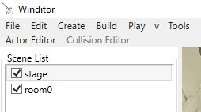
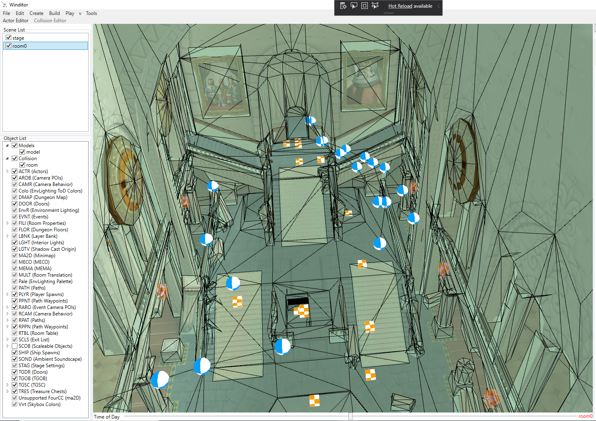
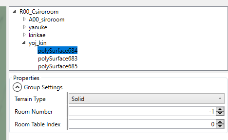

## Collision Editing
This tutorial will go over how to use Winditor's integrated collision editing mode.

### Switching to the Collision Editor

  

Under the main toolbar, you will see two more options: "Actor Editor" and "Collision Editor." Winditor will open with the Actor Editor enabled, and thus that option will be greyed out as in the image above. Select "Collision Editor" to switch to the collision editing mode. **You will not be able to select, edit, or move actors while in collision editing mode even though they are still visible.** To switch back to the Actor Editor, select that option in the toolbar.

### Selecting a Room

  

When you switch to the Collision Editor, you may see a translucent mesh appear in a room, or you may see nothing change at all. In either case, you can change which Room's collision mesh you are editing by selecting it from the Scene List in the top left corner of the program. Upon selecting a Room, its collision mesh will become visible.

  

You will now be able to use the Viewport to select the triangles in the collision mesh.

### Viewport
The viewport displays the collision mesh as a translucent overlay on the visual mesh of the selected Room. The triangles in the collision mesh are separated by black lines. Triangles become red when they are selected.

#### Controls

* Navigation controls are the same as in the Actor Editor: right-click and drag to rotate the view, and use the W, A, S, and D keys while holding the right mouse button to move around the map.
* **Left-click a triangle** to select it. Its collision properties will be displayed in the Mode Panel to the right of the Viewport.
* **Hold shift while left-clicking** to select multiple triangles. This allows you to edit the properties of all the selected triangles at once.
* **Hold control while left-clicking** to remove unwanted triangles from the current selection.

### Hierarchy View
The Hierarchy View can be found on the top right side of the program. It displays the hierarchy of nodes within the collision mesh.

#### Controls
* **Left-click the arrow to the left of a node** to display its children.
* **Left-click a node** to access its node properties, which are described below.
* **Double-click a node** to select all of the triangles that belong to that node.

### Properties Panel
The Properties Panel displays the editable properties of the currently selected triangle, group of triangles, or node.

### Triangle Properties

  

Collision triangles have a number of properties that can be modified. Here is a key that explains what each property means:

* **Sound ID**:
* **Exit Index**:
* **Wall Type**:
* **Special Type**:
* **Attribute Type**:
* **Ground Type**:
* **Camera ID**:
* **CamMoveBG**:
* **RoomCamID**:
* **RoomPathID**:
* **RoomPathPntNo**:
* **Camera Behavior**:
* **PolyColor**:
* **Link Number**:

### Node Properties

  

The nodes that make up the collision mesh's hierarchy have their own set of properties. These can be accessed by selecting the node in the hierarchy view.

* **Terrain Type**: Whether the triangles in this group are considered solid, water, or lava. **This property must be set for Link to swim in water!** It is not enough to set the triangles themselves to have water properties.
* **Room Number**: What Room this node is considered to be in. All nodes inherit this value from their parent nodes, so it is only necessary to set this on the root node; all other nodes can have this index be -1.
* **Room Table Index**: This determines what Room Table data is used when Link is above the triangles that belong to this node, even if he is in the air. This is often used in dungeons to pre-load rooms so that moving between rooms is as fast as possible.

  <a href="../tutorials.html">Back</a>

