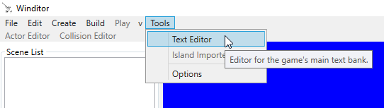
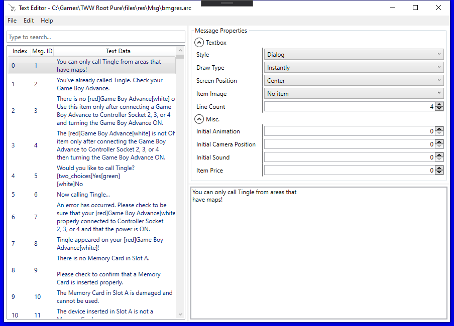

## Text Editor
This tutorial will go over Winditor's integrated text editor.

## Opening the Text Editor
In order to use the text editor, you must have a Game Root set in the Options menu. To set those up, see the [Getting Started](../basics/gettingstarted.html) guide.

To open the editor, go to Tools -> Text Editor:

  

## The Editor

  

  <a href="../tutorials.html">Back</a>

